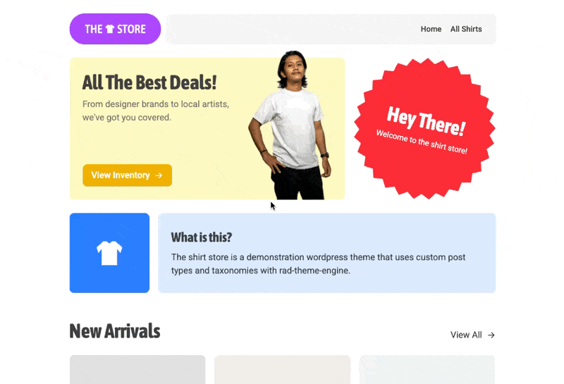

# The 👕 Store

An example WordPress theme for your convenience, made with __[RAD Theme Engine](https://github.com/open-function-computers-llc/rad-theme-engine)__.   

__RAD Theme Engine__ concepts this theme demonstrates:

- Custom post types (_[docs](https://rad-theme-engine.ofco.cloud/docs/configuration/custom-post-types/)_)
- Handlebars templates (_[docs](https://rad-theme-engine.ofco.cloud/docs/guides/handlebars/)_)
- Custom taxonomies (_[docs](https://rad-theme-engine.ofco.cloud/docs/configuration/custom-post-types/)_)
- Post fields (_[docs](https://rad-theme-engine.ofco.cloud/docs/reference/the-site-object/#post-fields)_)
- Menu rendering (_[docs](https://rad-theme-engine.ofco.cloud/docs/reference/rendermenu/)_)
- Pagination (_[docs](https://rad-theme-engine.ofco.cloud/docs/templating/paginationlinks/)_)
- Laravel Mix w/ Tailwind (_[docs](https://rad-theme-engine.ofco.cloud/docs/getting-started/starter-themes/)_)

Requirements for running this theme:
- [Advanced Custom Fields](https://www.advancedcustomfields.com/)
- php >= 7.4 (_rad-theme-engine_ requirement)

 

# Demo

 

# License

Licensed under the MIT license, see [LICENSE](https://github.com/open-function-computers-llc/rad-theme-engine-example-theme/blob/main/LICENSE)
